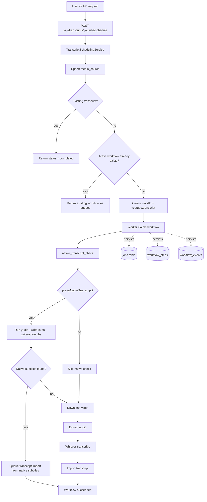

# Jobs and Workflow

The project uses two related execution models:

- `jobs` for low-level background tasks
- `workflows` for user-facing orchestration
- `media_sources` for normalized source-identity across platforms

## Jobs

Jobs are executed by a worker process.

Currently, the primary job types are:

- `youtube.download`
- `media.extract_audio`
- `whisper.transcribe`
- `transcript.import`

Job lifecycle:

1. Created with `queued` status
2. The worker claims the job under a lease
3. The job transitions to `running`
4. The worker records progress and logs
5. The job transitions to `succeeded`, `failed`, `cancelled`, or `dead`

## Workflow `youtube.summary`

This is the current orchestration flow for analyzing YouTube videos.

### Logic

1. Check for a native transcript.
2. If a native transcript is found, import it immediately.
3. If no native transcript is found, launch the manual pipeline.
4. Manual pipeline:
   - download video
   - extract audio
   - whisper transcribe
   - import transcript
5. Upon successful import, the workflow transitions to `succeeded`.

## Workflow `youtube.transcript`

This is the workflow used for the public transcript scheduling endpoint.

### Logic

1. Check for a native transcript.
2. If a native transcript is found, import it immediately.
3. If no native transcript is found, launch the manual pipeline.
4. Manual pipeline:
   - download video
   - extract audio
   - whisper transcribe
   - import transcript
5. Upon successful import, the workflow transitions to `succeeded`.

### Difference from `youtube.summary`

The worker uses the same set of steps, but uses a separate workflow type:

- `youtube.summary` for summary-oriented orchestration
- `youtube.transcript` for transcript scheduling and reuse

### Diagram

For visual inspection, open [workflows-visual.html](file:///Volumes/Data/Devs/Projects/AiSummarizer/docs/handbook/workflows-visual.html).

### Steps

| Step key | Step type | Purpose |
| --- | --- | --- |
| `native_transcript_check` | `native_check` | Searches for native subtitles |
| `download_video` | `job` | Creates a `youtube.download` job |
| `extract_audio` | `job` | Creates a `media.extract_audio` job |
| `transcribe_audio` | `job` | Creates a `whisper.transcribe` job |
| `import_transcript` | `job` | Creates a `transcript.import` job |

### Progress

The system publishes approximate progress:

- `5%` - native transcript check
- `15%` - downloading video
- `35%` - extracting audio
- `55%` - transcribing audio
- `80%` - importing transcript
- `100%` - completed

### DB Troubleshooting

If a workflow goes wrong, check:

- `workflows.status`
- `workflows.current_step_key`
- `workflow_steps.status` and `workflow_steps.output_json`
- `workflow_events` for timeline
- `jobs.status`, `jobs.progress_percent`, `jobs.progress_message`

## Events

Each workflow writes events into `workflow_events`.

This is used for:

- State tracing
- Error diagnostics
- Viewing the full execution timeline

## Output Directory

A separate folder is created for each workflow:

- `Workflows__OutputDirectory`
- Subfolder for each `workflowId`

Example structure:

- `.../workflows/{workflowId}/download/`
- `.../workflows/{workflowId}/audio/`
- `.../workflows/{workflowId}/transcript/`
- `.../workflows/{workflowId}/import/`

