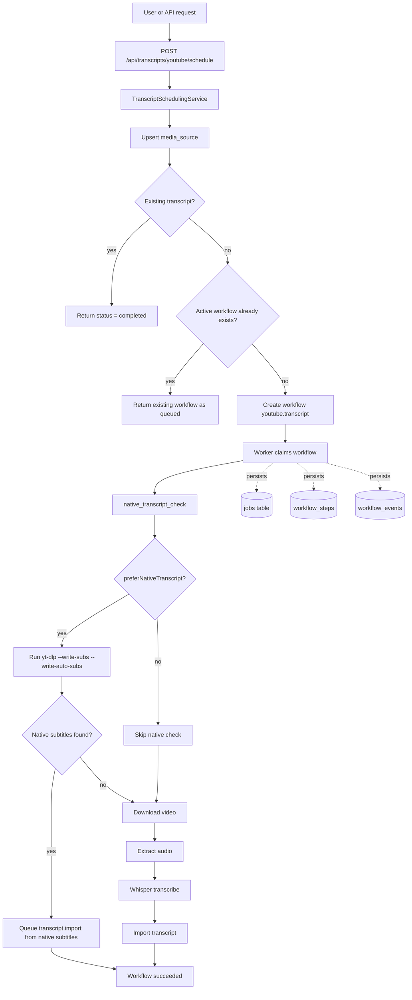

# Jobs и workflow

Проект использует две связанные модели исполнения:

- `jobs` для низкоуровневых фоновых задач
- `workflows` для user-facing orchestration
- `media_sources` для нормализованной source-identity между платформами

## Jobs

Jobs исполняются worker-процессом.

Основные job types сейчас:

- `youtube.download`
- `media.extract_audio`
- `whisper.transcribe`
- `transcript.import`

Жизненный цикл job:

1. создается в статусе `queued`
2. worker забирает job под lease
3. job переходит в `running`
4. worker пишет progress и logs
5. job завершается `succeeded`, `failed`, `cancelled` или `dead`

## Workflow `youtube.summary`

Это текущий orchestration flow для анализа YouTube видео.

### Логика

1. Проверяется native transcript.
2. Если native transcript найден, он импортируется сразу.
3. Если native transcript не найден, запускается manual pipeline.
4. Manual pipeline:
   - download video
   - extract audio
   - whisper transcribe
   - import transcript
5. После успешного import workflow завершается `succeeded`.

## Workflow `youtube.transcript`

Это workflow для public transcript scheduling endpoint.

### Логика

1. Проверяется native transcript.
2. Если native transcript найден, он импортируется сразу.
3. Если native transcript не найден, запускается manual pipeline.
4. Manual pipeline:
   - download video
   - extract audio
   - whisper transcribe
   - import transcript
5. После успешного import workflow завершается `succeeded`.

### Отличие от `youtube.summary`

В worker используется тот же набор шагов, но тип workflow отдельный:

- `youtube.summary` для summary-oriented orchestration
- `youtube.transcript` для transcript scheduling и reuse

### Диаграмма

Для визуального просмотра открой [workflows-visual.html](/Volumes/Data/Devs/Projects/AiSummarizer/docs/handbook/workflows-visual.html).

### Шаги

| Step key | Step type | Назначение |
| --- | --- | --- |
| `native_transcript_check` | `native_check` | поиск native subtitles |
| `download_video` | `job` | создание `youtube.download` |
| `extract_audio` | `job` | создание `media.extract_audio` |
| `transcribe_audio` | `job` | создание `whisper.transcribe` |
| `import_transcript` | `job` | создание `transcript.import` |

### Progress

Система публикует примерный прогресс:

- `5%` - native transcript check
- `15%` - downloading video
- `35%` - extracting audio
- `55%` - transcribing audio
- `80%` - importing transcript
- `100%` - completed

### Что проверять в БД

Если workflow идет не так, обычно смотрим:

- `workflows.status`
- `workflows.current_step_key`
- `workflow_steps.status` и `workflow_steps.output_json`
- `workflow_events` для таймлайна
- `jobs.status`, `jobs.progress_percent`, `jobs.progress_message`

## Events

Каждый workflow пишет события в `workflow_events`.

Это используется для:

- трассировки состояния
- диагностики ошибок
- просмотра полного таймлайна выполнения

## Output directory

Для workflow создается отдельный каталог:

- `Workflows__OutputDirectory`
- затем подпапка на каждый `workflowId`

Пример структуры:

- `.../workflows/{workflowId}/download/`
- `.../workflows/{workflowId}/audio/`
- `.../workflows/{workflowId}/transcript/`
- `.../workflows/{workflowId}/import/`
